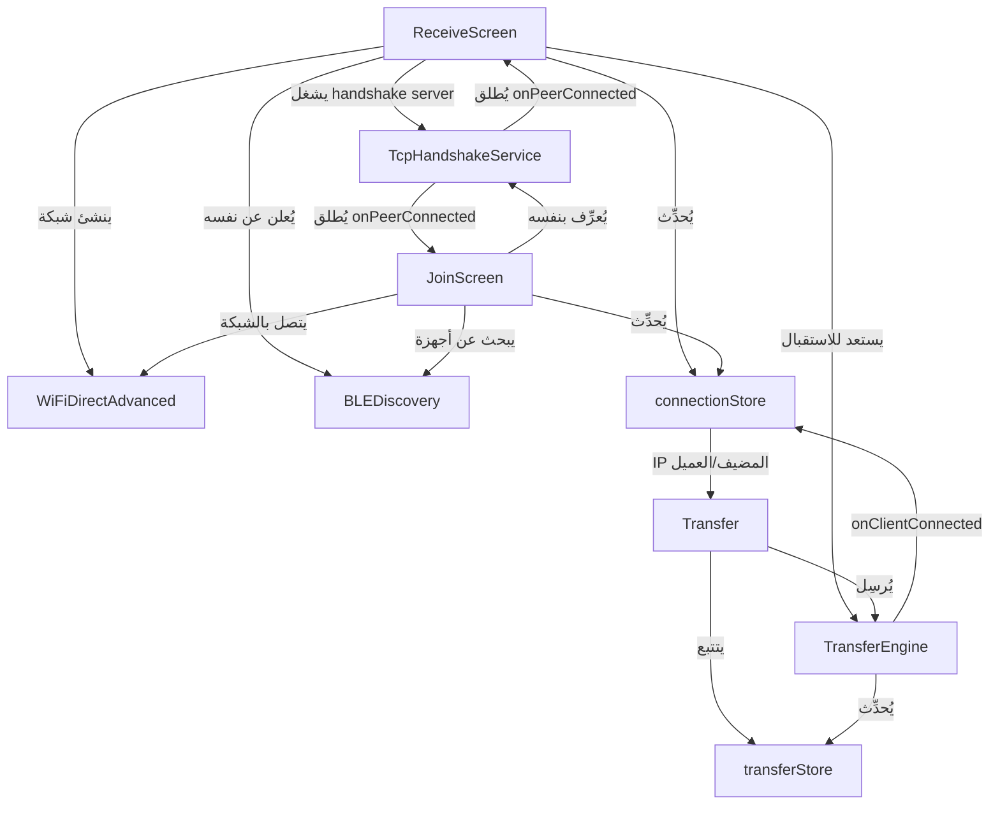

# MisterShare - توثيق المعمارية التقنية

> **نسخة:** 2.0 — مبني على React Native 0.77 + Kotlin Native Modules

---

## 📋 جدول المحتويات

1. [نظرة عامة](#1-نظرة-عامة)
2. [بنية الملفات](#2-بنية-الملفات)
3. [عملية الاتصال بين الجهازين](#3-عملية-الاتصال-بين-الجهازين)
4. [طبقة الاكتشاف - BLE Discovery](#4-طبقة-الاكتشاف---ble-discovery)
5. [طبقة الشبكة - WiFi Direct / LocalOnlyHotspot](#5-طبقة-الشبكة---wifi-direct--localonlyhotspot)
6. [نظام Handshake - TCP Handshake Protocol](#6-نظام-handshake---tcp-handshake-protocol)
7. [محرك النقل - Transfer Engine](#7-محرك-النقل---transfer-engine)
8. [إدارة الحالة - State Management](#8-إدارة-الحالة---state-management)
9. [الشاشات ودورة حياتها](#9-الشاشات-ودورة-حياتها)
10. [نظام HyperSpeed للنقل المتوازي](#10-نظام-hyperspeed-للنقل-المتوازي)
11. [نظام الصلاحيات](#11-نظام-الصلاحيات)
12. [تدفق البيانات الكامل](#12-تدفق-البيانات-الكامل)

---

## 1. نظرة عامة

**MisterShare** هو تطبيق لنقل الملفات بين الأجهزة يعمل بدون إنترنت، مستوحى من معمارية SHAREit. يستخدم ثلاث تقنيات رئيسية بشكل متدرج:

```
┌─────────────────────────────────────────────────┐
│              MisterShare Architecture            │
│                                                  │
│  اكتشاف الأجهزة        :  BLE (Bluetooth LE)    │
│  بناء الشبكة           :  LocalOnlyHotspot / P2P│
│  نقل الملفات           :  TCP Sockets (Port 12345)│
│  Handshake (المصافحة)  :  TCP Custom (Port 12321)│
└─────────────────────────────────────────────────┘
```

### أدوار الأجهزة

| الجهاز | الدور | ما يفعله |
|--------|-------|-----------|
| **المرسِل (Host)** | Group Owner | ينشئ نقطة اتصال (Hotspot) وينتظر |
| **المستقبِل (Client)** | Joiner | يبحث عن الأجهزة ويتصل |

> ⚠️ **ملاحظة**: كلا الجهازين يمكنهما الإرسال والاستقبال بعد الاتصال (ثنائي الاتجاه).

---

## 2. بنية الملفات

```
i:\MisterShare2\
├── App.tsx                          ⬅ نقطة الدخول الرئيسية
├── src/
│   ├── screens/                     ⬅ الشاشات
│   │   ├── Home.tsx                  (الصفحة الرئيسية)
│   │   ├── Connect.tsx               (شاشة الاتصال)
│   │   ├── ReceiveScreen.tsx  ⭐     (جهاز المضيف - ينشئ الاتصال)
│   │   ├── JoinScreen.tsx     ⭐     (جهاز العميل - يبحث ويتصل)
│   │   ├── ScanScreen.tsx            (مسح QR كود)
│   │   ├── Transfer.tsx       ⭐     (تتبع تقدم النقل)
│   │   ├── FileBrowser.tsx           (متصفح الملفات)
│   │   ├── History.tsx               (سجل النقل)
│   │   ├── Settings.tsx              (الإعدادات)
│   │   └── Onboarding.tsx            (الترحيب)
│   │
│   ├── services/                    ⬅ الخدمات
│   │   ├── WiFiDirectAdvanced.ts  ⭐ (التحكم في WiFi Direct)
│   │   ├── BLEDiscovery.ts        ⭐ (اكتشاف الأجهزة عبر BLE)
│   │   ├── TcpHandshakeService.ts ⭐ (بروتوكول المصافحة)
│   │   ├── TransferEngine.ts      ⭐ (محرك النقل)
│   │   ├── NsdService.ts             (خدمة اكتشاف الشبكة)
│   │   ├── PermissionsManager.ts     (إدارة الصلاحيات)
│   │   ├── Authentication.ts         (المصادقة)
│   │   ├── Encryption.ts             (التشفير)
│   │   ├── ChecksumService.ts        (التحقق من سلامة الملفات)
│   │   ├── FileSystem.ts             (نظام الملفات)
│   │   ├── SAFService.ts             (Storage Access Framework)
│   │   ├── SoundService.ts           (الأصوات)
│   │   ├── NotificationService.ts    (الإشعارات)
│   │   └── ToastManager.tsx          (رسائل Toast)
│   │
│   ├── store/                       ⬅ إدارة الحالة (Zustand)
│   │   ├── connectionStore.ts  ⭐    (حالة الاتصال الكاملة)
│   │   ├── transferStore.ts    ⭐    (طابور النقل والتاريخ)
│   │   ├── fileStore.ts              (ملفات الجهاز)
│   │   └── useAppStore.ts            (حالة التطبيق العامة)
│   │
│   ├── components/                  ⬅ المكونات البصرية
│   ├── types/                       ⬅ TypeScript Types
│   └── theme/                       ⬅ الألوان والخطوط
│
└── android/                         ⬅ الكود الأصلي (Kotlin)
    └── app/src/main/java/
        ├── WiFiDirectAdvancedModule.kt  (WiFi P2P + Hotspot)
        ├── BLEAdvertiserModule.kt       (BLE Advertising)
        ├── BLEScannerModule.kt          (BLE Scanning)
        ├── BLEConnectionModule.kt       (BLE GATT Server/Client)
        ├── TcpHandshakeModule.kt        (Handshake Server)
        └── TransferSocketModule.kt      (TCP File Transfer)
```

---

## 3. عملية الاتصال بين الجهازين

### المراحل الخمس للاتصال

```
الجهاز A (المضيف/Host)                    الجهاز B (العميل/Client)
═══════════════════════                    ═══════════════════════════
[1] ينشئ نقطة اتصال (Hotspot)
    LocalOnlyHotspot → WiFi P2P             [1] يبدأ BLE Scanning
    يحصل على: SSID, Password, IP

[2] يبدأ BLE Advertising               ◄──[2] يكتشف الجهاز A عبر BLE
    يبث: اسم الجهاز + SSID + Password        يظهر في شاشة Radar

[3] يشغل Handshake Server              ←──[3] المستخدم يضغط على الجهاز A
    (Port 12321)                             يتصل بـ Hotspot WiFi
                                             يرسل: HELLO + اسمه + ID

[4] يظهر نافذة ◄──────────────────────────[4] ينتظر رد
    "جهاز X يريد الاتصال"
    المستخدم يضغط "موافق"
    يرسل: WELCOME ──────────────────────►  [4] يستلم WELCOME
                                             يبدأ receiver server

[5] كلا الجهازين جاهزان للإرسال والاستقبال
    ═══════════════════════════════════════
    TCP Transfer على Port 12345
```

---

## 4. طبقة الاكتشاف - BLE Discovery

**الملف:** `src/services/BLEDiscovery.ts`  
**الوحدات الأصلية:** `BLEAdvertiser`, `BLEScanner`, `BLEConnection`

### دور الجهاز المضيف (Host - Advertising)

```typescript
// ReceiveScreen.tsx
await BLEDiscovery.startAdvertising(deviceName, ssid, password);
```

**ما يحدث داخلياً:**
1. `BLEAdvertiserModule.kt` — يبث إشارة BLE في الهواء تحتوي على:
   - اسم الجهاز
   - SSID الشبكة
   - كلمة المرور (مشفرة في Manufacturer Data)
2. `BLEConnectionModule.kt` — يشغل GATT Server لاستقبال طلبات الاتصال

### دور الجهاز العميل (Client - Scanning)

```typescript
// JoinScreen.tsx
await BLEDiscovery.startScanning();
BLEDiscovery.onDeviceFound((device) => {
    // device.ssid و device.password متاحان مباشرة!
    // → الاتصال الفوري بدون ضغط المستخدم
});
```

**ما يحدث داخلياً:**
1. `BLEScannerModule.kt` — يمسح إشارات BLE المحيطة
2. يفلتر الأجهزة التي تعمل بـ MisterShare
3. يفك تشفير بيانات SSID/Password من Manufacturer Data
4. يُطلق حدث `onDeviceFound`

### نظام الموافقة (Approval System)

عندما يضغط المستخدم على جهاز في شاشة Radar:

```
العميل يرسل طلب BLE GATT ──► المضيف يستقبل onConnectionRequest
                                       ↓
                              يظهر Modal: "هل تقبل الاتصال؟"
                                       ↓
                     موافق          رفض
                       ↓               ↓
                 approveConnection   rejectConnection
                       ↓
               يرسل credentials للعميل عبر BLE GATT
                       ↓
               العميل يستلم onCredentialsReceived
               ويتصل بالشبكة مباشرة
```

---

## 5. طبقة الشبكة - WiFi Direct / LocalOnlyHotspot

**الملف:** `src/services/WiFiDirectAdvanced.ts`  
**الوحدة الأصلية:** `WiFiDirectAdvancedModule.kt`

### نظام الفولباك التلقائي (Universal Fallback System)

```typescript
// ReceiveScreen.tsx
const info = await WiFiDirectAdvanced.createGroupWithFallback();
```

يجرب الطرق بالترتيب حتى يجد واحدة تعمل:

```
┌─────────────────────────────────────────────────────┐
│              Universal Fallback System               │
│                                                      │
│  1. LocalOnlyHotspot (Android 8+)                   │
│     أسرع طريقة — تقنية SHAREit الأصلية             │
│     IP: 192.168.43.1                                │
│                   ↓ فشل؟                            │
│  2. WiFi Direct P2P 5GHz                            │
│     أسرع إشارة — يتطلب دعم الجهاز                 │
│     IP: 192.168.49.1                                │
│                   ↓ فشل؟                            │
│  3. WiFi Direct P2P 2.4GHz                          │
│     متوافق مع معظم الأجهزة                         │
│     IP: 192.168.49.1                                │
│                   ↓ فشل؟                            │
│  4. Legacy P2P Mode                                 │
│     الطريقة القديمة — تعمل على كل الأجهزة          │
└─────────────────────────────────────────────────────┘
```

### معلومات الاتصال المُعادة

```typescript
interface GroupResult {
    success: boolean;
    method: 'LocalOnlyHotspot' | 'P2P_5GHz' | 'P2P_2.4GHz' | 'Legacy';
    ssid: string;      // اسم الشبكة
    password: string;  // كلمة المرور
    ip: string;        // IP المضيف (للـ QR كود والنقل)
    band?: string;     // '5GHz' | '2.4GHz'
}
```

### اكتشاف IP المضيف (Client Side)

بعد اتصال العميل بالشبكة، يحتاج لمعرفة IP المضيف:

```typescript
// connectionStore.ts - discoverHostIP()
// الطريقة 1: DHCP Gateway (الأسرع والأدق)
const gatewayIp = await WiFiDirectAdvanced.getConnectedGatewayIp();

// الطريقة 2: NSD/mDNS Discovery (احتياطية)
NsdServiceInstance.startDiscovery();
// ينتظر onServiceResolved على Port 12321

// الطريقة 3: الافتراضي إذا فشل كل شيء
// DIRECT-* → 192.168.49.1
// أخرى     → 192.168.43.1
```

---

## 6. نظام Handshake - TCP Handshake Protocol

**الملف:** `src/services/TcpHandshakeService.ts`  
**الوحدة الأصلية:** `TcpHandshakeModule.kt`  
**المنفذ:** `12321`

### البروتوكول

```
العميل (Client)                          المضيف (Host)
════════════════                          ═════════════════
                                          يشغل Server على :12321

يتصل بـ IP_المضيف:12321 ──────────────►

يرسل HELLO:
{                                         يستقبل الطلب
 "type": "HELLO",                                ↓
 "name": "Samsung S24",        هل الجهاز في قائمة الموثوقين؟
 "id": "unique-device-id-xxx"
}                                    نعم              لا
                                      ↓                ↓
                                 auto-approve     يُظهر Modal
                                                 "X يريد الاتصال"
                                                  ↓         ↓
                                              موافق       رفض
                                                ↓
يستلم WELCOME ◄──────────────────── يرسل WELCOME:
{                                    {
 "type": "WELCOME",                   "type": "WELCOME",
 "hostName": "iPhone 15",             "hostName": "iPhone 15",
 "transferPort": 12345                "transferPort": 12345
}                                    }

كلا الجهازين جاهزان للنقل ✅
```

### إدارة الأجهزة الموثوقة (Trusted Devices)

```typescript
// عند الموافقة مع "تذكر هذا الجهاز"
await TcpHandshakeService.approveConnection(clientId, true); // addToTrusted = true

// في المرة القادمة: auto-approve تلقائياً بدون نافذة
```

---

## 7. محرك النقل - Transfer Engine

**الملف:** `src/services/TransferEngine.ts`  
**الوحدة الأصلية:** `TransferSocketModule.kt`  
**المنفذ:** `12345`

### إرسال ملف

```typescript
// transferStore.ts → startQueueProcessing()
await TransferEngine.sendFile(
    filePath,        // مسار الملف
    fileSize,        // حجمه بالبايت
    filename,        // اسمه المعروض
    onProgress,      // callback للتقدم
    isGroupOwner     // دور الجهاز (مهم لربط Socket الصحيح)
);
```

**داخلياً في Kotlin:**
```
TransferSocketModule.connectAndSendWithRole(ip, 12345, path, name, isHost)
```

### استقبال ملف

```typescript
// transferStore.ts → startReceiverListening()
TransferEngine.startServer(
    onReceiveStart,   // يبدأ الاستقبال
    onProgress,       // تحديث شريط التقدم
    onComplete,       // الملف وصل ✅
    onError           // خطأ ❌
);
```

**مسار الحفظ التلقائي:**
```
/storage/emulated/0/Download/MisterShare/
├── Images/    (jpg, png, gif, webp)
├── Videos/    (mp4, mkv, avi, mov)
├── Apps/      (apk)
├── Music/     (mp3, wav)
└── Files/     (باقي الأنواع)
```

### الأحداث الأصلية (Native Events)

يستمع `TransferEngine` لهذه الأحداث من Kotlin:

| الحدث | المعنى |
|-------|--------|
| `onMeta` | بدأ استقبال ملف جديد (يحتوي بيانات الملف) |
| `onProgress` | تحديث التقدم (bytes, total, speed) |
| `onConfirmedProgress` | التقدم المؤكد من المستقبِل (للمرسِل) |
| `onReceiveComplete` | اكتمل استقبال الملف |
| `onSendComplete` | اكتمل إرسال الملف |
| `onClientConnected` | عميل جديد اتصل (IP العميل) |
| `onError` | حدث خطأ |
| `onLog` | رسائل تشخيصية من Kotlin |

---

## 8. إدارة الحالة - State Management

يستخدم التطبيق **Zustand** لإدارة الحالة العالمية.

### connectionStore.ts

```typescript
interface ConnectionState {
    isConnected: boolean;     // هل الجهاز متصل؟
    isConnecting: boolean;    // هل في طور الاتصال؟
    isGroupOwner: boolean;    // هل هو المضيف؟
    ssid: string | null;      // اسم الشبكة المتصل بها
    passphrase: string | null;// كلمة مرور الشبكة
    serverIP: string;         // IP المضيف (لإرسال الملفات)
    peerIP: string | null;    // IP العميل (المضيف يرسل إلى هنا)
    connectedPeers: ConnectedPeer[]; // قائمة الأجهزة المتصلة
}
```

**كيف يُحدَّد IP الهدف للإرسال:**
```typescript
// connectionStore.ts → getTransferTargetIP()
if (isGroupOwner && peerIP) {
    return peerIP;      // المضيف يرسل إلى IP العميل
}
return serverIP;        // العميل يرسل إلى IP المضيف
```

### transferStore.ts

```typescript
interface TransferState {
    queue: TransferItem[];    // طابور الملفات
    sendStatus: 'idle' | 'running' | 'paused' | 'completed';
    receiveStatus: 'idle' | 'running' | 'paused' | 'completed';
    isServerRunning: boolean; // هل Server الاستقبال يعمل؟
    history: TransferHistory[]; // سجل كل النقلات
}
```

**إدارة الجلسات (Sessions):**
```
كل عملية نقل لها SessionId فريد
→ يمنع تلوث الطابور بين الإرسال والاستقبال
→ يعيد تعيين الطابور نظيفاً لكل جلسة جديدة
```

---

## 9. الشاشات ودورة حياتها

### ReceiveScreen.tsx (الجهاز المضيف)

```
عند الدخول:
  1. طلب الصلاحيات اللازمة
  2. تشغيل GPS إذا لزم
  3. createGroupWithFallback() → ينشئ الشبكة
  4. startHandshakeServer() → ينتظر العملاء
  5. startBLEAdvertising() → يجعل نفسه مرئياً
  6. registerNSDService() → للاكتشاف الاحتياطي
  7. startReceiverListening() → يستعد لاستقبال الملفات

عند الاتصال (onPeerConnected):
  8. يُبلَّغ المستخدم بالاتصال
  9. يُعيَّن peerIP للإرسال العكسي
  10. يُنتقل إلى Transfer Screen

QR Code يحتوي:
  MSHARE:S:{ssid};P:{password};H:{hostIP};;
```

### JoinScreen.tsx (الجهاز العميل)

```
عند الدخول:
  1. تهيئة BLE Discovery
  2. BLE Scanning ← الطريقة الأولية
  3. WiFi Scanning ← احتياطية
  4. كل 5 ثوانٍ: مسح جديد

عندما يجد جهازاً عبر BLE:
  A. إذا BLE يحتوي SSID/Password مباشرة:
     → اتصال فوري تلقائي (Connectionless Mode)
  B. إذا BLE بدون credentials:
     → يُعرض في الـ Radar
     → المستخدم يضغط عليه
     → requesting connection via GATT
     → ينتظر onCredentialsReceived

بعد الاتصال بالشبكة:
  1. اكتشاف IP المضيف (Gateway → NSD → افتراضي)
  2. performHandshake() ← التعريف بالنفس
  3. startReceiverListening() ← لاستقبال ملفات عكسية
  4. الانتقال إلى Transfer Screen
```

### Transfer.tsx (شاشة النقل)

```
الأوضاع:
  - mode='send': يُرسِل الملفات المختارة
  - mode='receive': يُعرِض التقدم للملفات القادمة

الإرسال:
  1. startQueueProcessing(serverIP)
  2. لكل ملف:
     a. إذا مجلد: ضغطه ZIP أولاً
     b. إذا APK: نسخه إلى Cache أولاً
     c. TransferEngine.sendFile()
     d. تحديث التقدم كل 200ms
  3. الانتقال للملف التالي

الاستقبال:
  يستمع لأحداث TransferEngine
  يُحدِّث شريط التقدم تلقائياً
```

---

## 10. نظام HyperSpeed للنقل المتوازي

**للملفات +10MB:** يُستخدم نقل متوازي بـ 8 TCP connections.

```typescript
// TransferEngine.ts
private static readonly HYPERSPEED_THRESHOLD = 10 * 1024 * 1024; // 10MB

async sendFileHyperSpeed(...) {
    if (size > HYPERSPEED_THRESHOLD) {
        // 8 اتصالات TCP متواكبة
        TransferSocketModule.parallelSend(serverAddress, filePath, filename);
    } else {
        // اتصال واحد للملفات الصغيرة
        TransferSocketModule.connectAndSend(serverAddress, 12345, filePath, filename);
    }
}
```

**آلية HyperSpeed:**
```
الملف مقسَّم إلى 8 أجزاء متساوية
 ↓
8 اتصالات TCP تُرسل في نفس الوقت
 ↓
المستقبِل يُجمِّع الأجزاء بالترتيب الصحيح
 ↓
ملف واحد متكامل ✅
```

---

## 11. نظام الصلاحيات

**الملف:** `src/services/PermissionsManager.ts`

### الصلاحيات المطلوبة

| الصلاحية | الاستخدام | Android |
|----------|-----------|---------|
| `ACCESS_FINE_LOCATION` | WiFi Scan + P2P | كل الإصدارات |
| `NEARBY_WIFI_DEVICES` | WiFi P2P + Hotspot | Android 13+ |
| `BLUETOOTH_ADVERTISE` | BLE Advertising | Android 12+ |
| `BLUETOOTH_SCAN` | BLE Scanning | Android 12+ |
| `BLUETOOTH_CONNECT` | BLE Connection | Android 12+ |
| `READ_MEDIA_IMAGES/VIDEO/AUDIO` | قراءة الوسائط | Android 13+ |
| `READ_EXTERNAL_STORAGE` | قراءة الملفات | Android ≤12 |
| `WRITE_EXTERNAL_STORAGE` | حفظ الملفات | Android ≤9 |

---

## 12. تدفق البيانات الكامل

```
┌─────────────────────────────────────────────────────────────────┐
│                    تدفق إرسال ملف كامل                         │
└─────────────────────────────────────────────────────────────────┘

المستخدم يختار ملف من FileBrowser
         │
         ▼
transferStore.setOutgoingFiles(files)  ← مرحلة التجهيز
         │
         ▼
Transfer.tsx يستلم الملفات
         │
         ▼
processFilesForQueue(files)
  ├── إذا مجلد: expandDirectory() → قائمة ملفات مسطحة
  ├── إذا APK: copyApkToCache() → نسخ لمجلد مؤقت
  └── إذا عادي: fileToTransferItem() مباشرة
         │
         ▼
transferStore.addToQueue(items)
         │
         ▼
transferStore.startQueueProcessing(serverIP)
         │
         ▼
  لكل ملف في الطابور:
  ├── إذا preprocess = zipDirectory:
  │     SAFService.createZipFromDirectory()
  │     ينتظر ZIP ينتهي
  │     │
  ▼
TransferEngine.sendFile(path, size, name, onProgress, isGroupOwner)
         │
         ▼ (Native)
TransferSocketModule.connectAndSendWithRole(IP, 12345, path, name)
         │
         ▼
TCP Socket → يرسل:
  [1] Header: {name, size, checksum}
  [2] Data: الملف بالكامل عبر stream
         │
         ▼
المستقبِل يستلم onMeta → onProgress → onReceiveComplete
         │
         ▼
الملف يُحفَظ في:
  /Download/MisterShare/{Images|Videos|Files|...}/filename
         │
         ▼
MediaStore تُحدَّث (يظهر في Gallery/Files)
         │
         ▼
onSendComplete → Promise تُحَل
         │
         ▼
history.addToHistory() → يُحفَظ في AsyncStorage
         │
         ▼
processNext() → الملف التالي ⟳
```

---

## 🔗 اعتماديات الوحدات الرئيسية



---

## 📌 ملاحظات تقنية مهمة

### 1. مشكلة Error 22 (Radio Interference)
بعض الأجهزة تتعارض فيها BLE Scan مع WiFi Scan.  
**الحل:** إيقاف BLE Scan قبل الاتصال بـ 500ms.

### 2. Android 13+ IP الديناميكي
IP المضيف يتغير في Android 13+ مع كل جلسة.  
**الحل:** استخدام `getConnectedGatewayIp()` (DHCP Gateway) بدلاً من IP ثابت.

### 3. الإعادة إلى الحياة (Resume Optimization)
إذا كانت الشبكة تعمل فعلاً، التطبيق يعيد استخدامها بدون إعادة إنشاء:
```typescript
const existing = await WiFiDirectAdvanced.getHotspotCredentials();
if (existing) { /* استخدام الموجودة */ } else { createGroupWithFallback() }
```

### 4. Bidirectional Transfer
كلا الجهازين يشغّلان server للاستقبال في نفس الوقت:
- المضيف يُرسِل إلى `peerIP` (IP العميل)
- العميل يُرسِل إلى `serverIP` (IP المضيف)
- التمييز يتم عبر `isGroupOwner` في `connectAndSendWithRole()`

---

## 13. نظام الإعلانات - Google AdMob Integration

> **المبدأ الأساسي:** الإعلانات لا تُعرَض أبداً أثناء الاتصال أو نقل الملفات.

### الملفات المُضافة / المُعدَّلة

| الملف | التغيير |
|-------|---------|
| `src/services/AdService.ts` | ✅ ملف جديد — محرك الإعلانات الآمن |
| `App.tsx` | ✅ تهيئة AdMob مؤجلة بـ 1 ثانية |
| `app.json` | ✅ إضافة `android_app_id` لـ AdMob |
| `android/app/src/main/AndroidManifest.xml` | ✅ إضافة AdMob `APPLICATION_ID` meta-data |
| `package.json` | ✅ إضافة `react-native-google-mobile-ads@14.7.2` |

### AdService.ts — الضمانات الثلاثة

```typescript
// src/services/AdService.ts

export const AdService = {
    loadInterstitial: async () => {

        // ── ضمان 1: لا إنترنت = لا إعلان ──────────────────────────
        const netState = await NetInfo.fetch();
        if (!netState.isConnected || !netState.isInternetReachable) {
            return; // لا نُحمِّل الإعلان — نحمي شبكة P2P المحلية
        }

        // ── ضمان 2: اتصال P2P نشط = لا إعلان ──────────────────────
        const { isConnected, isGroupOwner, isConnecting } = useConnectionStore.getState();
        if (isConnected || isGroupOwner || isConnecting) {
            return; // جهازان متصلان الآن — لا نتدخل أبداً
        }

        // ... تحميل الإعلان
    },

    showInterstitial: () => {

        // ── ضمان 3: لا نعرض الإعلان أثناء النقل ──────────────────
        const { isConnected, isGroupOwner } = useConnectionStore.getState();
        if (isConnected || isGroupOwner) {
            return; // حماية عمليات الإرسال والاستقبال الجارية
        }

        // كذلك: فترة راحة 60 ثانية بين إعلان وآخر
        if (timeSinceLastAd < AD_COOLDOWN_MS) return;

        // ... عرض الإعلان
    }
};
```

### تهيئة AdMob في App.tsx

```typescript
// App.tsx — داخل useEffect
// تأجيل 1 ثانية لضمان تحميل واجهة التطبيق أولاً
setTimeout(() => {
    mobileAds().initialize().then(() => {
        AdService.loadInterstitial(); // يُحمَّل فقط إذا لا يوجد P2P
    });
}, 1000);
```

### إعدادات AndroidManifest.xml

```xml
<!-- AdMob App ID -->
<meta-data
    android:name="com.google.android.gms.ads.APPLICATION_ID"
    android:value="ca-app-pub-XXXXXXXXXXXXXXXX~XXXXXXXXXX"
    tools:replace="android:value"/>
```

### إعدادات app.json

```json
{
  "react-native-google-mobile-ads": {
    "android_app_id": "ca-app-pub-XXXXXXXXXXXXXXXX~XXXXXXXXXX"
  }
}
```

### وحدات الإعلان المستخدمة

| الوحدة | النوع | ملاحظة |
|--------|-------|---------|
| `Interstitial` | إعلان كامل الشاشة | يظهر في لحظات الانتظار فقط |

### قاعدتا الأمان الجوهريتان

```
┌──────────────────────────────────────────────────────────┐
│  وقت الاتصال النشط (isConnected / isGroupOwner = true)  │
│  ══════════════════════════════════════════════════════  │
│  ❌ لا تحميل إعلان                                      │
│  ❌ لا عرض إعلان                                        │
│  ❌ لا استدعاء AdMob SDK                                 │
│                                                          │
│  الإعلانات تعمل فقط حين:                                │
│  ✅ لا يوجد اتصال P2P                                   │
│  ✅ يوجد اتصال إنترنت فعلي                              │
│  ✅ مرّت 60 ثانية على آخر إعلان                         │
└──────────────────────────────────────────────────────────┘
```

### سبب التغيير من الإصدار القديم

كان الإصدار السابق `react-native-google-mobile-ads@16.2.1` يتعارض مع
نظام Codegen في React Native 0.77 بسبب `NativeAppModuleSpec`. تم الرجوع إلى
الإصدار `14.7.2` المستقر والمتوافق.

---

## 📌 ملاحظات تقنية مهمة — تحديث مارس 2026

### 5. إصلاح مشكلة عدم ظهور نافذة القبول (host لا يستقبل الاتصال)
**السبب:** كان التحديث الجديد للتصاميم يحتوي على تعطيل لسطر `socket.bind()` في
`TcpHandshakeModule.kt`، مما تسبب في إرسال بيانات الـ HELLO عبر شبكة الإنترنت
بدلاً من شبكة P2P المحلية.

**الحل:** استعادة النسخة الأصلية من `TcpHandshakeModule.kt` من الـ commit
`"النسخه الجاهزه والاتصال الجاهز"` الذي كان فيه الاتصال يعمل بشكل مثالي.

```kotlin
// TcpHandshakeModule.kt — الكود الصحيح (مُستعاد)
if (localIp != "0.0.0.0" && !localIp.startsWith("127")) {
    socket.bind(InetSocketAddress(localIp, 0)) // ✅ يجبر الأندرويد على P2P
}
// وكذلك:
isHandshaking = false // ✅ في finally — يسمح بإعادة المحاولة
```

### 6. إصلاح مكتبة RNFS
**السبب:** حزمة `@dr.pogodin/react-native-fs` غير متوافقة مع TurboModules في
React Native 0.77 وتفشل في Codegen.

**الحل:** الرجوع لـ `react-native-fs` الأصلية في جميع الملفات:
- `src/services/AppManager.ts`
- `src/services/FileSystem.ts`
- `src/services/SAFService.ts`
- `src/store/transferStore.ts`

---

*آخر تحديث: مارس 2026 — المشروع: MisterShare v2.0*
*الفرع: admob-integration — دمج إعلانات AdMob بأمان كامل*
